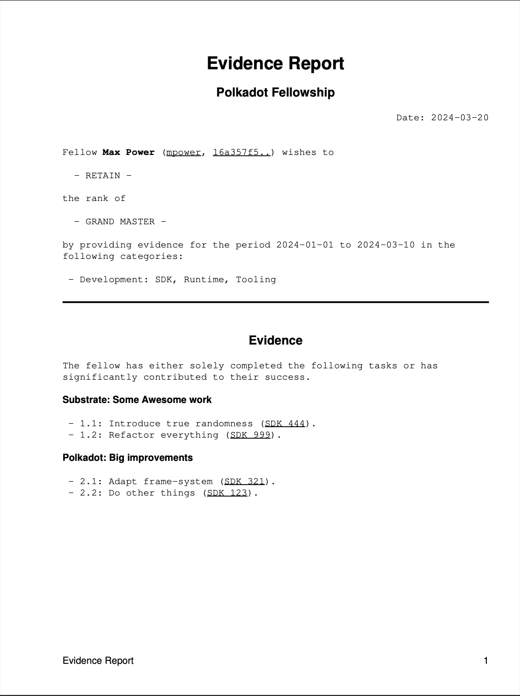

# Collective Evidence Reports

Provides a way to create evidence reports for Polkadot On-Chain collectives. Reports are machine readable and can be rendered. This is just a proposed format for work evidence - it is not required to do it this way.

The rendered HTML/PDF output can look like this:



## Creating Evidence - Manually

The main part of this repository is the [schema](./schema/evidence_report.json) file. It provides a guideline to what information should be provided in a work report for a System Collective.

The most straight-forward way is to copy the [template](./example/template.evidence) and fill it out manually. Thats it, no CLI needed! Although without editor support and validation it will be difficult.

If you want editor support and auto-complete for the fields, then you can download the [schema](./schema/evidence_report.json) file and configure it in your editor. Its explained for [VsCode](#vs-codes) below.  
There is a `validate evidence` subcommand available to check that the evidence files conform to the schema.

### VS Code Schema Integration

Open your `settings.json` file and insert the following, or extend this section. You need to replace the path with the path of the schema. This is just an example:

```json
"yaml.schemas": {
	"/Users/oliver/Documents/work/collective-cli/schema/evidence_report.json": "*.evidence",
},
 "files.associations": {
	"*.evidence": "yaml",
},
```

## Creating Evidence - Interactive

You can install the CLI like this: 

```sh
cargo install collective
```

Running `collective new evidence` will prompt you with a few basic questions. These will be stored in a config file and are available on the next run.

## Rendering Evidence

The CLI can convert `.evidence` files into HTML. It is also possible to further convert the HTML files into PDF with:

```sh
# https://github.com/michaelrsweet/htmldoc
htmldoc --webpage -f example/example.pdf example/example.html
# https://github.com/ilaborie/html2pdf
html2pdf example/example.html
```

## TODO
- [ ] Add schema for join_request.
- [ ] Add e2e tests. First attempt with this did not work for interactive CLI, see [tests](src/tests).
